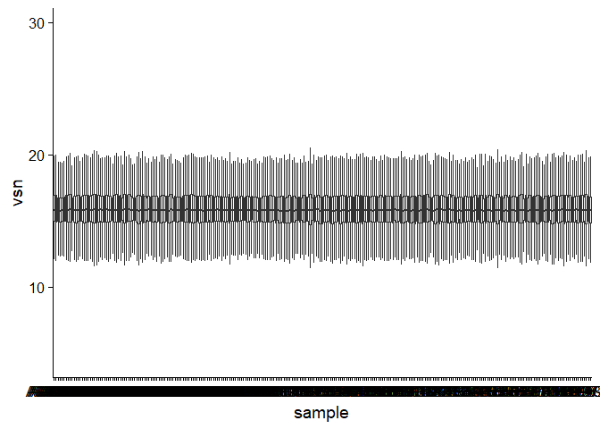

R Notebook
================

Testcommit of a github document

``` r
library(tidyverse)

prot_merge %>% 
  as_tibble(rownames = "uniprotid") %>% 
  pivot_longer(cols = -uniprotid, names_to = "sample", values_to = "vsn") %>% 
  ggplot(aes(x=sample, y = vsn)) +
  geom_boxplot(outlier.shape = NA) +
  cowplot::theme_cowplot()
```

<!-- -->
